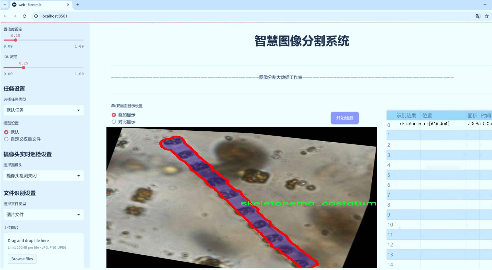

# 浮游生物图像分割系统源码＆数据集分享
 [yolov8-seg-GhostHGNetV2＆yolov8-seg-C2f-CloAtt等50+全套改进创新点发刊_一键训练教程_Web前端展示]

### 1.研究背景与意义

项目参考[ILSVRC ImageNet Large Scale Visual Recognition Challenge](https://gitee.com/YOLOv8_YOLOv11_Segmentation_Studio/projects)

项目来源[AAAI Global Al lnnovation Contest](https://kdocs.cn/l/cszuIiCKVNis)

研究背景与意义

浮游生物是海洋生态系统中重要的组成部分，它们不仅在食物链中扮演着关键角色，还对全球碳循环和气候变化具有深远影响。随着海洋环境的变化，浮游生物的种类和数量也在不断变化，这对海洋生态的健康和可持续发展提出了新的挑战。因此，准确识别和分类浮游生物成为了海洋生物学研究中的一项重要任务。传统的浮游生物分类方法主要依赖于人工观察和显微镜分析，这不仅耗时耗力，而且容易受到人为因素的影响，导致分类结果的不一致性和准确性不足。为了解决这一问题，基于计算机视觉和深度学习的自动化图像分析技术逐渐成为研究的热点。

近年来，YOLO（You Only Look Once）系列模型因其高效的实时目标检测能力而受到广泛关注。YOLOv8作为该系列的最新版本，进一步提升了检测精度和速度，适用于多种复杂场景的目标检测任务。然而，针对浮游生物图像的分割需求，YOLOv8的标准模型仍存在一定的局限性，尤其是在细小物体的检测和复杂背景下的分割效果。因此，基于改进YOLOv8的浮游生物图像分割系统的研究显得尤为重要。

本研究旨在通过改进YOLOv8模型，开发一个高效的浮游生物图像分割系统，以实现对3500幅浮游生物图像的自动化处理。这些图像涵盖了20种不同类别的浮游生物，包括常见的如Asteromphalus hyalinus、Ceratium furca、Chaetoceros curvisetus等。通过对这些图像的深度学习训练，我们希望能够提高浮游生物的检测精度和分割效果，从而为海洋生态监测和研究提供更为可靠的数据支持。

此外，浮游生物的种类繁多且形态各异，传统的图像处理方法往往难以有效应对这种复杂性。通过构建基于改进YOLOv8的分割系统，我们不仅能够实现对浮游生物的高效识别，还能为后续的生态学研究提供丰富的样本数据。这将为研究者在浮游生物的种群动态、生态习性及其与环境变化之间的关系等方面提供重要的参考依据。

总之，基于改进YOLOv8的浮游生物图像分割系统的研究，不仅有助于提升浮游生物分类的自动化水平，还将推动海洋生态学的研究进展。通过建立一个高效、准确的浮游生物图像分析平台，我们期待能够为海洋生态保护和可持续发展贡献一份力量。这一研究不仅具有重要的学术价值，也将为实际的海洋生态监测提供切实可行的技术支持。

### 2.图片演示




##### 注意：由于此博客编辑较早，上面“2.图片演示”和“3.视频演示”展示的系统图片或者视频可能为老版本，新版本在老版本的基础上升级如下：（实际效果以升级的新版本为准）

  （1）适配了YOLOV8的“目标检测”模型和“实例分割”模型，通过加载相应的权重（.pt）文件即可自适应加载模型。

  （2）支持“图片识别”、“视频识别”、“摄像头实时识别”三种识别模式。

  （3）支持“图片识别”、“视频识别”、“摄像头实时识别”三种识别结果保存导出，解决手动导出（容易卡顿出现爆内存）存在的问题，识别完自动保存结果并导出到tempDir中。

  （4）支持Web前端系统中的标题、背景图等自定义修改，后面提供修改教程。

  另外本项目提供训练的数据集和训练教程,暂不提供权重文件（best.pt）,需要您按照教程进行训练后实现图片演示和Web前端界面演示的效果。

### 3.视频演示

[3.1 视频演示](https://www.bilibili.com/video/BV1iAmNYAEPL/)

### 4.数据集信息展示

##### 4.1 本项目数据集详细数据（类别数＆类别名）

nc: 20
names: ['asteromphalus_hyalinus', 'ceratium_furca', 'ceratium_trichorecos', 'chaetoceros_curvisetus', 'coscinodiscus_oculus_iridis', 'dinophysis_caudata', 'dinophysis_miles', 'eucampia_zodiacus', 'noctilluca_scintillans', 'odontella_mobiliensis', 'ornithocercus_thumii', 'planktoniella_sol', 'podolampas_bipes', 'proboscia_alata', 'prorocentrum_micans', 'protoperidinium_oceanicum', 'pseudo_nitzschia', 'skeletonema_costatum', 'thalassionema_nitzschioides', 'trichodesmium_erythraeum']


##### 4.2 本项目数据集信息介绍

数据集信息展示

在现代生态研究和环境监测中，浮游生物的图像分割技术正逐渐成为重要的工具。为了提升这一领域的研究效果，我们构建了一个名为“20-plankton-segment”的数据集，旨在为改进YOLOv8-seg的浮游生物图像分割系统提供强有力的支持。该数据集包含20个不同的浮游生物类别，涵盖了多样的形态特征和生态功能，为模型的训练和测试提供了丰富的样本。

数据集中包含的20个类别分别是：asteromphalus_hyalinus、ceratium_furca、ceratium_trichorecos、chaetoceros_curvisetus、coscinodiscus_oculus_iridis、dinophysis_caudata、dinophysis_miles、eucampia_zodiacus、noctilluca_scintillans、odontella_mobiliensis、ornithocercus_thumii、planktoniella_sol、podolampas_bipes、proboscia_alata、prorocentrum_micans、protoperidinium_oceanicum、pseudo_nitzschia、skeletonema_costatum、thalassionema_nitzschioides以及trichodesmium_erythraeum。这些浮游生物不仅在海洋生态系统中扮演着重要角色，还在全球碳循环和营养物质循环中发挥着关键作用。

每个类别的图像均经过精心标注，确保数据的准确性和可靠性。数据集中的图像来源于不同的海域和生态环境，具有较高的多样性和代表性。这种多样性使得模型在训练过程中能够学习到不同环境下浮游生物的形态特征，进而提高其在实际应用中的泛化能力。通过对这些图像的分割，研究人员可以更好地理解浮游生物的分布特征、种群动态以及其与环境因子的关系。

在数据集的构建过程中，我们特别关注了图像的质量和分辨率，以确保训练模型时能够获得清晰的特征信息。每张图像都经过严格的筛选，确保其能够真实反映浮游生物的形态特征和生态环境。此外，为了提高模型的鲁棒性，数据集中还包含了不同光照条件、背景复杂度和图像质量的样本，这将有助于模型在实际应用中应对各种挑战。

在训练YOLOv8-seg模型时，我们将利用该数据集的丰富信息，通过数据增强技术进一步扩展样本的多样性。这将有助于提升模型对浮游生物的识别和分割精度，使其在实际应用中更具实用性。随着深度学习技术的不断发展，基于“20-plankton-segment”数据集的研究将为浮游生物的监测和生态研究提供新的视角和方法。

总之，“20-plankton-segment”数据集不仅为浮游生物图像分割技术的发展提供了重要的基础数据，也为生态学研究提供了新的工具和方法。通过对浮游生物的深入分析，我们将能够更好地理解海洋生态系统的复杂性，进而为保护和管理海洋资源提供科学依据。随着数据集的不断完善和模型技术的进步，我们期待在未来的研究中取得更多突破，为可持续发展贡献力量。


### 5.全套项目环境部署视频教程（零基础手把手教学）

[5.1 环境部署教程链接（零基础手把手教学）](https://www.bilibili.com/video/BV1jG4Ve4E9t/?vd_source=bc9aec86d164b67a7004b996143742dc)


[5.2 安装Python虚拟环境创建和依赖库安装视频教程链接（零基础手把手教学）](https://www.bilibili.com/video/BV1nA4VeYEze/?vd_source=bc9aec86d164b67a7004b996143742dc)

### 6.手把手YOLOV8-seg训练视频教程（零基础小白有手就能学会）

[6.1 手把手YOLOV8-seg训练视频教程（零基础小白有手就能学会）](https://www.bilibili.com/video/BV1cA4VeYETe/?vd_source=bc9aec86d164b67a7004b996143742dc)


按照上面的训练视频教程链接加载项目提供的数据集，运行train.py即可开始训练



     Epoch   gpu_mem       box       obj       cls    labels  img_size
     1/200     0G   0.01576   0.01955  0.007536        22      1280: 100%|██████████| 849/849 [14:42<00:00,  1.04s/it]
               Class     Images     Labels          P          R     mAP@.5 mAP@.5:.95: 100%|██████████| 213/213 [01:14<00:00,  2.87it/s]
                 all       3395      17314      0.994      0.957      0.0957      0.0843

     Epoch   gpu_mem       box       obj       cls    labels  img_size
     2/200     0G   0.01578   0.01923  0.007006        22      1280: 100%|██████████| 849/849 [14:44<00:00,  1.04s/it]
               Class     Images     Labels          P          R     mAP@.5 mAP@.5:.95: 100%|██████████| 213/213 [01:12<00:00,  2.95it/s]
                 all       3395      17314      0.996      0.956      0.0957      0.0845

     Epoch   gpu_mem       box       obj       cls    labels  img_size
     3/200     0G   0.01561    0.0191  0.006895        27      1280: 100%|██████████| 849/849 [10:56<00:00,  1.29it/s]
               Class     Images     Labels          P          R     mAP@.5 mAP@.5:.95: 100%|███████   | 187/213 [00:52<00:00,  4.04it/s]
                 all       3395      17314      0.996      0.957      0.0957      0.0845


### 7.50+种全套YOLOV8-seg创新点代码加载调参视频教程（一键加载写好的改进模型的配置文件）

[7.1 50+种全套YOLOV8-seg创新点代码加载调参视频教程（一键加载写好的改进模型的配置文件）](https://www.bilibili.com/video/BV1Hw4VePEXv/?vd_source=bc9aec86d164b67a7004b996143742dc)

### 8.YOLOV8-seg图像分割算法原理

原始YOLOv8-seg算法原理

YOLOv8-seg算法是YOLO系列目标检测模型中的最新进展，旨在实现更高效的目标检测与分割。该算法在YOLOv5的基础上进行了多项重要的优化与升级，尤其是在模型结构、特征提取和处理速度等方面的显著提升，使其在实时应用中表现出色。YOLOv8-seg不仅继承了YOLO系列的优良传统，还通过引入轻量化设计和创新的网络结构，推动了目标检测和图像分割技术的发展。

首先，YOLOv8-seg算法的网络结构可以分为四个主要部分：输入端、骨干网络、颈部网络和头部网络。输入端采用了马赛克增强、混合增强、空间扰动和颜色扰动等多种数据增强技术，以提高模型的鲁棒性和泛化能力。这些预处理手段能够有效地扩展训练数据集，使得模型在面对复杂场景时依然能够保持较高的检测精度。

在骨干网络方面，YOLOv8-seg使用了C2f模块替代了YOLOv5中的C3模块。C2f模块通过引入更多的分支和跨层连接，丰富了梯度流的路径，从而增强了特征的表达能力。这种设计不仅提高了模型的特征提取能力，还有效地减少了参数量，使得YOLOv8-seg在保持高性能的同时，具备了更轻量化的特性。此外，骨干网络中的卷积操作被优化为3×3的深度卷积，进一步提升了计算效率。

YOLOv8-seg的颈部网络采用了特征金字塔网络（FPN）与路径聚合网络（PAN）的结合，旨在实现多尺度特征的高效融合。FPN通过自底向上的特征提取和自顶向下的特征融合，使得不同尺度的特征信息能够有效地结合，增强了模型对小目标的检测能力。而PAN则通过加强特征传递，提升了对不同缩放尺度对象的特征融合能力。YOLOv8-seg在此基础上引入了BiFPN网络，进一步提高了对不同尺度特征信息的提取速度和精度。

在头部网络方面，YOLOv8-seg采用了解耦头结构，将分类和定位任务分开处理。与传统的耦合头结构不同，解耦头结构通过并行的分支分别提取类别特征和位置特征，进而各自使用1×1卷积进行分类和定位。这种设计不仅提升了模型的检测精度，还加速了非最大抑制（NMS）过程，显著提高了检测速度。此外，YOLOv8-seg采用了无锚框检测策略，减少了锚框预测的数量，使得模型在处理复杂场景时更加灵活。

YOLOv8-seg在标签分配策略上也进行了创新，采用了动态标签分配策略，以解决正负样本匹配的问题。该策略通过对目标框和目标分数的动态调整，确保了不同尺度的目标能够得到合理的标签分配。这种方法有效地避免了传统聚类方法在数据集不足时可能出现的标签不准确问题，从而提高了模型的训练效率和准确性。

在损失计算方面，YOLOv8-seg结合了Varifocal Loss和CIoULoss等多种损失函数，以提升模型对边界框预测的精准性。Varifocal Loss通过不对称参数对正负样本进行加权，确保了高质量正样本对损失的贡献更大，从而使得模型能够更专注于重要的目标检测任务。而CIoULoss则通过考虑目标框的重叠程度、中心点距离和长宽比等因素，进一步提高了模型在边界框回归方面的表现。

综上所述，YOLOv8-seg算法通过一系列创新性的设计和优化，显著提升了目标检测与分割的性能。其轻量化的网络结构、有效的特征融合机制以及灵活的标签分配策略，使得YOLOv8-seg在各种应用场景中都能展现出卓越的性能。无论是在实时视频监控、自动驾驶还是工业检测等领域，YOLOv8-seg都具备了广泛的应用潜力，为未来的智能视觉系统奠定了坚实的基础。随着深度学习技术的不断发展，YOLOv8-seg无疑将成为目标检测与分割领域的重要里程碑，推动相关研究和应用的进一步深入。


### 9.系统功能展示（检测对象为举例，实际内容以本项目数据集为准）

图9.1.系统支持检测结果表格显示

  图9.2.系统支持置信度和IOU阈值手动调节

  图9.3.系统支持自定义加载权重文件best.pt(需要你通过步骤5中训练获得)

  图9.4.系统支持摄像头实时识别

  图9.5.系统支持图片识别

  图9.6.系统支持视频识别

  图9.7.系统支持识别结果文件自动保存

  图9.8.系统支持Excel导出检测结果数据


### 10.50+种全套YOLOV8-seg创新点原理讲解（非科班也可以轻松写刊发刊，V11版本正在科研待更新）

#### 10.1 由于篇幅限制，每个创新点的具体原理讲解就不一一展开，具体见下列网址中的创新点对应子项目的技术原理博客网址【Blog】：


[10.1 50+种全套YOLOV8-seg创新点原理讲解链接](https://gitee.com/qunmasj/good)

#### 10.2 部分改进模块原理讲解(完整的改进原理见上图和技术博客链接)【如果此小节的图加载失败可以通过CSDN或者Github搜索该博客的标题访问原始博客，原始博客图片显示正常】
### YOLOv8简介

YOLOv8是一种最新的SOTA算法，提供了N/S/M/L/X尺度的不同大小模型，以满足不同场景的需求。本章对算法网络的新特性进行简要介绍。


1）骨干网络和Neck
开发者设计了C2f模块对CSPDarkNet 53和PAFPN进行改造。相比C3模块，C2f模块拥有更多的分支跨层链接，使模型的梯度流更加丰富，显著增强了模型的特征提取能力。
2)Head部分
Head部分采用无锚框设计，将分类任务和回归任务进行了解耦，独立的分支将更加专注于其所负责的特征信息。
3）损失计算
模型使用CIOU Loss作为误差损失函数，并通过最小化DFL进一步提升边界框的回归精度。同时模型采用了TaskAlignedAssigner样本分配策略，以分类得分和IOU的高阶组合作为指标指导正负样本选择，实现了高分类得分和高IOU的对齐，有效地提升了模型的检测精度。


### D-LKA Attention简介
自2010年代中期以来，卷积神经网络（CNNs）已成为许多计算机视觉应用的首选技术。它们能够从原始数据中自动提取复杂的特征表示，无需手动进行特征工程，这引起了医学图像分析社区的极大兴趣。许多成功的CNN架构，如U-Net、全卷积网络、DeepLab或SegCaps（分割胶囊），已经被开发出来。这些架构在语义分割任务中取得了巨大成功，先前的最新方法已经被超越。

在计算机视觉研究中，不同尺度下的目标识别是一个关键问题。在CNN中，可检测目标的大小与相应网络层的感受野尺寸密切相关。如果一个目标扩展到超出这个感受野的边界，这可能会导致欠分割结果。相反，与目标实际大小相比使用过大的感受野可能会限制识别，因为背景信息可能会对预测产生不必要的影响。

解决这个问题的一个有希望的方法涉及在并行使用具有不同尺寸的多个Kernel，类似于Inception块的机制。然而，由于参数和计算要求的指数增长，将Kernel大小增加以容纳更大的目标在实践中受到限制。因此，出现了各种策略，包括金字塔池化技术和不同尺度的扩张卷积，以捕获多尺度的上下文信息。

另一个直观的概念涉及将多尺度图像金字塔或它们的相关特征表示直接纳入网络架构。然而，这种方法存在挑战，特别是在管理训练和推理时间方面的可行性方面存在挑战。在这个背景下，使用编码器-解码器网络，如U-Net，已被证明是有利的。这样的网络在较浅的层中编码外观和位置，而在更深的层中，通过神经元的更广泛的感受野捕获更高的语义信息和上下文信息。

一些方法将来自不同层的特征组合在一起，或者预测来自不同尺寸的层的特征以使用多尺度的信息。此外，出现了从不同尺度的层中预测特征的方法，有效地实现了跨多个尺度的见解整合。然而，大多数编码器-解码器结构面临一个挑战：它们经常无法在不同尺度之间保持一致的特征，并主要使用最后一个解码器层生成分割结果。

语义分割是一项任务，涉及根据预定义的标签集为图像中的每个像素预测语义类别。这项任务要求提取高级特征同时保留初始的空间分辨率。CNNs非常适合捕获局部细节和低级信息，尽管以忽略全局上下文为代价。视觉Transformer（ViT）架构已经成为解决处理全局信息的视觉任务的关键，包括语义分割，取得了显著的成功。

ViT的基础是注意力机制，它有助于在整个输入序列上聚合信息。这种能力使网络能够合并远程的上下文提示，超越了CNN的有限感受野尺寸。然而，这种策略通常会限制ViT有效建模局部信息的能力。这种局限可能会妨碍它们检测局部纹理的能力，这对于各种诊断和预测任务至关重要。这种缺乏局部表示可以归因于ViT模型处理图像的特定方式。

ViT模型将图像分成一系列Patch，并使用自注意力机制来模拟它们之间的依赖关系。这种方法可能不如CNN模型中的卷积操作对感受野内提取局部特征有效。ViT和CNN模型之间的这种图像处理方法的差异可能解释了CNN模型在局部特征提取方面表现出色的原因。

近年来，已经开发出创新性方法来解决Transformer模型内部局部纹理不足的问题。其中一种方法是通过互补方法将CNN和ViT特征结合起来，以结合它们的优势并减轻局部表示的不足。TransUNet是这种方法的早期示例，它在CNN的瓶颈中集成了Transformer层，以模拟局部和全局依赖关系。HiFormer提出了一种解决方案，将Swin Transformer模块和基于CNN的编码器结合起来，生成两个多尺度特征表示，通过Double-Level Fusion模块集成。UNETR使用基于Transformer的编码器和CNN解码器进行3D医学图像分割。CoTr和TransBTS通过Transformer在低分辨率阶段增强分割性能，将CNN编码器和解码器连接在一起。

增强局部特征表示的另一种策略是重新设计纯Transformer模型内部的自注意力机制。在这方面，Swin-Unet在U形结构中集成了一个具有线性计算复杂性的Swin Transformer块作为多尺度 Backbone 。MISSFormer采用高效Transformer来解决视觉Transformer中的参数问题，通过在输入块上进行不可逆的降采样操作。D-Former引入了一个纯Transformer的管道，具有双重注意模块，以分段的方式捕获细粒度的局部注意和与多元单元的交互。然而，仍然存在一些特定的限制，包括计算效率低下，如TransUNet模型所示，对CNN Backbone 的严重依赖，如HiFormer所观察到的，以及对多尺度信息的忽略。

此外，目前的分割架构通常采用逐层处理3D输入 volumetric 的方法，无意中忽视了相邻切片之间的潜在相关性。这一疏忽限制了对 volumetric 信息的全面利用，因此损害了定位精度和上下文集成。此外，必须认识到，医学领域的病变通常在形状上发生变形。因此，用于医学图像分析的任何学习算法都必须具备捕捉和理解这些变形的能力。与此同时，该算法应保持计算效率，以便处理3D volumetric数据。

为了解决上述提到的挑战，作者提出了一个解决方案，即可变形大卷积核注意力模块（Deformable LKA module），它是作者网络设计的基本构建模块。这个模块明确设计成在有效处理上下文信息的同时保留局部描述符。作者的架构在这两个方面的平衡增强了实现精确语义分割的能力。

值得注意的是，参考该博客引入了一种基于数据的感受野的动态适应，不同于传统卷积操作中的固定滤波器Mask。这种自适应方法使作者能够克服与静态方法相关的固有限制。这种创新方法还扩展到了D-LKA Net架构的2D和3D版本的开发。

在3D模型的情况下，D-LKA机制被量身定制以适应3D环境，从而实现在不同 volumetric 切片之间无缝信息交互。最后，作者的贡献通过其计算效率得到进一步强调。作者通过仅依靠D-LKA概念的设计来实现这一点，在各种分割基准上取得了显著的性能，确立了作者的方法作为一种新的SOTA方法。

在本节中，作者首先概述方法论。首先，作者回顾了由Guo等人引入的大卷积核注意力（Large Kernel Attention，LKA）的概念。然后，作者介绍了作者对可变形LKA模块的创新探索。在此基础上，作者介绍了用于分割任务的2D和3D网络架构。

大卷积核提供了与自注意力机制类似的感受野。可以通过使用深度卷积、深度可扩展卷积和卷积来构建大卷积核，从而减少了参数和计算量。构建输入维度为和通道数的卷积核的深度卷积和深度可扩展卷积的卷积核大小的方程如下：


具有卷积核大小和膨胀率。参数数量和浮点运算（FLOPs）的计算如下：


FLOPs的数量与输入图像的大小成线性增长。参数的数量随通道数和卷积核大小的增加而呈二次增长。然而，由于它们通常都很小，因此它们不是限制因素。

为了最小化对于固定卷积核大小K的参数数量，可以将方程3对于膨胀率的导数设定为零：


例如，当卷积核大小为时，结果是。将这些公式扩展到3D情况是直接的。对于大小为和通道数C的输入，3D情况下参数数量和FLOPs 的方程如下：


具有卷积核大小和膨胀。


利用大卷积核进行医学图像分割的概念通过引入可变形卷积得以扩展。可变形卷积可以通过整数偏移自由调整采样网格以进行自由变形。额外的卷积层从特征图中学习出变形，从而创建一个偏移场。基于特征本身学习变形会导致自适应卷积核。这种灵活的卷积核形状可以提高病变或器官变形的表示，从而增强了目标边界的定义。

负责计算偏移的卷积层遵循其相应卷积层的卷积核大小和膨胀。双线性插值用于计算不在图像网格上的偏移的像素值。如图2所示，D-LKA模块可以表示为：


其中输入特征由表示，。表示为注意力图，其中每个值表示相应特征的相对重要性。运算符  表示逐元素乘法运算。值得注意的是，LKA不同于传统的注意力方法，它不需要额外的规范化函数，如或。这些规范化函数往往忽视高频信息，从而降低了基于自注意力的方法的性能。

在该方法的2D版本中，卷积层被可变形卷积所替代，因为可变形卷积能够改善对具有不规则形状和大小的目标的捕捉能力。这些目标在医学图像数据中常常出现，因此这种增强尤为重要。

然而，将可变形LKA的概念扩展到3D领域会带来一定的挑战。主要的约束来自于需要用于生成偏移的额外卷积层。与2D情况不同，由于输入和输出通道的性质，这一层无法以深度可分的方式执行。在3D环境中，输入通道对应于特征，而输出通道扩展到，其中是卷积核的大小。大卷积核的复杂性导致沿第3D的通道数扩展，导致参数和FLOPs大幅增加。因此，针对3D情况采用了另一种替代方法。在现有的LKA框架中，深度卷积之后引入了一个单独的可变形卷积层。这种战略性的设计调整旨在减轻扩展到3D领域所带来的挑战。


2D网络的架构如图1所示。第一变种使用MaxViT作为编码器组件，用于高效特征提取，而第二变种则结合可变形LKA层进行更精细、卓越的分割。

在更正式的描述中，编码器生成4个分层输出表示。首先，卷积干扰将输入图像的维度减小到。随后，通过4个MaxViT块的4个阶段进行特征提取，每个阶段后跟随降采样层。随着过程进展到解码器，实施了4个阶段的D-LKA层，每个阶段包含2个D-LKA块。然后，应用Patch扩展层以实现分辨率上采样，同时减小通道维度。最后，线性层负责生成最终的输出。

2D D-LKA块的结构包括LayerNorm、可变形LKA和多层感知器（MLP）。积分残差连接确保了有效的特征传播，即使在更深层也是如此。这个安排可以用数学方式表示为：


其中输入特征，层归一化LN，可变形LKA注意力，深度卷积，线性层和GeLU激活函数。

3D网络架构如图1所示，采用编码器-解码器设计进行分层结构化。首先，一个Patch嵌入层将输入图像的维度从（）减小到（）。在编码器中，采用了3个D-LKA阶段的序列，每个阶段包含3个D-LKA块。在每个阶段之后，通过降采样步骤将空间分辨率减半，同时将通道维度加倍。中央瓶颈包括另一组2个D-LKA块。解码器结构与编码器相对称。

为了将特征分辨率加倍，同时减少通道数，使用转置卷积。每个解码器阶段都使用3个D-LKA块来促进远距离特征依赖性。最终的分割输出由一个卷积层产生，后面跟随一个卷积层以匹配特定类别的通道要求。

为了建立输入图像和分割输出之间的直接连接，使用卷积形成了一个跳跃连接。额外的跳跃连接根据简单的加法对来自其他阶段的特征进行融合。最终的分割图是通过和卷积层的组合产生的。

3D D-LKA块包括层归一化，后跟D-LKA注意力，应用了残差连接的部分。随后的部分采用了一个卷积层，后面跟随一个卷积层，两者都伴随着残差连接。这个整个过程可以总结如下：


带有输入特征 、层归一化 、可变形 LKA 、卷积层 和输出特征 的公式。是指一个前馈网络，包括2个卷积层和激活函数。

表7显示了普通卷积和构建卷积的参数数量比较。尽管标准卷积的参数数量在通道数较多时急剧增加，但分解卷积的参数总体较低，并且增长速度不那么快。

与分解卷积相比，可变形分解卷积增加了大量参数，但仍然明显小于标准卷积。可变形卷积的主要参数是由偏移网络创建的。在这里，作者假设可变形深度卷积的Kernel大小为（5,5），可变形深度空洞卷积的Kernel大小为（7,7）。这导致了21×21大小的大Kernel的最佳参数数量。更高效地生成偏移量的方法将大大减少参数数量。


值得注意的是，引入可变形LKA确实会增加模型的参数数量和每秒的浮点运算次数（FLOPS）。然而，重要的是强调，这增加的计算负载不会影响作者模型的整体推理速度。

相反，对于Batch-size > 1，作者甚至观察到推理时间的减少，如图7所示。例如，基于作者的广泛实验，作者观察到对于Batch-size为16，具有可变形卷积和没有可变形卷积的推理时间分别为8.01毫秒和17.38毫秒。作者认为这是由于在2D中对可变形卷积的高效实现所致。为了测量时间，使用了大小为（）的随机输入。在GPU热身周期50次迭代之后，网络被推断了1000次。测量是在NVIDIA RTX 3090 GPU上进行的。


为了充分利用性能与参数之间的权衡关系，作者在图8中可视化了在Synapse 2D数据集上报告的DSC和HD性能以及基于参数数量的内存消耗。D-LKA Net引入了相当多的参数，约为101M。这比性能第二好的方法ScaleFormer使用的111.6M参数要少。

与更轻量级的DAEFormer模型相比，作者实现了更好的性能，这证明了参数增加的合理性。大多数参数来自于MaxViT编码器；因此，将编码器替换为更高效的编码器可以减少模型参数。值得注意的是，在此可视化中，作者最初将HD和内存值都归一化到[0, 100]范围内。随后，作者将它们从100缩小，以增强更高值的表示。


### 11.项目核心源码讲解（再也不用担心看不懂代码逻辑）

#### 11.1 train.py

以下是代码中最核心的部分，并附上详细的中文注释：

```python
import os
import torch
import yaml
from ultralytics import YOLO  # 导入YOLO模型库

if __name__ == '__main__':  # 确保该模块被直接运行时才执行以下代码
    # 设置训练参数
    workers = 1  # 数据加载的工作进程数
    batch = 8  # 每个批次的样本数量，需根据显存/内存进行调整
    device = "0" if torch.cuda.is_available() else "cpu"  # 检查是否有可用的GPU

    # 获取数据集的yaml配置文件的绝对路径
    data_path = abs_path(f'datasets/data/data.yaml', path_type='current')

    # 将路径格式转换为Unix风格
    unix_style_path = data_path.replace(os.sep, '/')
    # 获取目录路径
    directory_path = os.path.dirname(unix_style_path)

    # 读取YAML文件，保持原有顺序
    with open(data_path, 'r') as file:
        data = yaml.load(file, Loader=yaml.FullLoader)

    # 修改YAML文件中的路径项
    if 'train' in data and 'val' in data and 'test' in data:
        data['train'] = directory_path + '/train'  # 更新训练集路径
        data['val'] = directory_path + '/val'      # 更新验证集路径
        data['test'] = directory_path + '/test'    # 更新测试集路径

        # 将修改后的数据写回YAML文件
        with open(data_path, 'w') as file:
            yaml.safe_dump(data, file, sort_keys=False)

    # 加载YOLO模型配置文件和预训练权重
    model = YOLO(r"C:\codeseg\codenew\50+种YOLOv8算法改进源码大全和调试加载训练教程（非必要）\改进YOLOv8模型配置文件\yolov8-seg-C2f-Faster.yaml").load("./weights/yolov8s-seg.pt")

    # 开始训练模型
    results = model.train(
        data=data_path,  # 指定训练数据的配置文件路径
        device=device,  # 使用指定的设备进行训练
        workers=workers,  # 指定使用的工作进程数
        imgsz=640,  # 输入图像的大小设置为640x640
        epochs=100,  # 训练100个epoch
        batch=batch,  # 每个批次的大小设置为8
    )
```

### 代码核心部分说明：
1. **导入必要的库**：导入`os`、`torch`、`yaml`和`YOLO`模型库。
2. **设置训练参数**：包括工作进程数、批次大小和设备选择（GPU或CPU）。
3. **读取和修改YAML配置文件**：读取数据集的配置文件，更新训练、验证和测试集的路径，并将修改后的内容写回文件。
4. **加载YOLO模型**：根据指定的配置文件和预训练权重加载YOLO模型。
5. **训练模型**：调用`train`方法开始训练，传入必要的参数，如数据路径、设备、工作进程数、图像大小、训练轮数和批次大小。

这个 `train.py` 文件是一个用于训练 YOLO（You Only Look Once）模型的 Python 脚本。它的主要功能是加载数据集、配置模型参数并开始训练。下面是对代码的逐行分析和说明。

首先，脚本导入了一些必要的库，包括 `os`、`torch`、`yaml` 和 `ultralytics` 中的 YOLO 模型。`matplotlib` 库用于图形显示，但在这里它被设置为使用 `TkAgg` 后端。

在 `if __name__ == '__main__':` 这一行之后，确保只有在直接运行该脚本时才会执行以下代码。接下来，设置了一些训练参数，包括工作进程数 `workers` 和批次大小 `batch`。批次大小可以根据计算机的显存和内存进行调整，如果显存不足，可以适当降低这个值。接着，代码判断是否有可用的 GPU，如果有，则将设备设置为 "0"（即第一个 GPU），否则使用 CPU。

接下来，代码通过 `abs_path` 函数获取数据集配置文件 `data.yaml` 的绝对路径，并将路径中的分隔符统一为 Unix 风格。然后，使用 `os.path.dirname` 获取该路径的目录部分。

随后，代码打开 `data.yaml` 文件并读取其内容，使用 `yaml` 库将其解析为 Python 字典。接着，检查字典中是否包含 `train`、`val` 和 `test` 这三个键。如果存在，则将这些键的值修改为相应的训练、验证和测试数据集的路径，并将修改后的数据重新写回到 YAML 文件中。

接下来，代码加载 YOLO 模型的配置文件，并使用预训练的权重文件进行初始化。这里的配置文件路径和权重文件路径是硬编码的，用户可以根据需要进行修改。

最后，调用 `model.train()` 方法开始训练模型。训练过程中指定了数据配置文件的路径、设备、工作进程数、输入图像的大小（640x640）、训练的 epoch 数（100）以及每个批次的大小（8）。

总的来说，这个脚本提供了一个完整的训练流程，从数据准备到模型训练，适合用于 YOLO 模型的训练任务。用户可以根据自己的需求调整参数和配置文件路径。

#### 11.2 ultralytics\models\yolo\__init__.py

以下是保留的核心代码部分，并附上详细的中文注释：

```python
# 导入Ultralytics YOLO库中的分类、检测、姿态估计和分割功能
from ultralytics.models.yolo import classify, detect, pose, segment

# 从当前模块导入YOLO模型
from .model import YOLO

# 定义模块的公开接口，指定可以被外部访问的功能
__all__ = 'classify', 'segment', 'detect', 'pose', 'YOLO'
```

### 代码注释说明：

1. **导入功能模块**：
   - `from ultralytics.models.yolo import classify, detect, pose, segment`：这行代码从Ultralytics的YOLO模型库中导入了四个主要功能：
     - `classify`：用于图像分类的功能。
     - `detect`：用于目标检测的功能。
     - `pose`：用于姿态估计的功能。
     - `segment`：用于图像分割的功能。

2. **导入YOLO模型**：
   - `from .model import YOLO`：这行代码从当前模块的`model`文件中导入了YOLO模型的实现，便于后续使用。

3. **定义公开接口**：
   - `__all__ = 'classify', 'segment', 'detect', 'pose', 'YOLO'`：这行代码定义了模块的公开接口，指定了可以被外部访问的名称。只有在这个列表中的名称才能被`from module import *`语句导入，增强了模块的封装性。

通过这些核心部分，代码实现了YOLO模型的功能导入和模块的接口定义，便于后续使用和扩展。

这个程序文件是Ultralytics YOLO模型的初始化文件，文件名为`__init__.py`，它的主要作用是定义模块的公共接口。首先，文件开头的注释表明这是Ultralytics YOLO项目的一部分，并且该项目遵循AGPL-3.0许可证。

接下来，文件通过`from`语句导入了四个功能模块：`classify`、`detect`、`pose`和`segment`，这些模块分别用于不同的计算机视觉任务。具体来说，`classify`用于图像分类，`detect`用于目标检测，`pose`用于姿态估计，而`segment`则用于图像分割。

此外，文件还从当前目录下的`model`模块中导入了`YOLO`类。这个类是YOLO模型的核心实现，可能包含了模型的构建、训练和推理等功能。

最后，`__all__`变量被定义为一个元组，包含了可以被外部导入的公共接口的名称。这意味着当用户使用`from ultralytics.models.yolo import *`时，只会导入`classify`、`segment`、`detect`、`pose`和`YOLO`这几个名称，从而避免了不必要的名称冲突和隐藏实现细节。

总体来说，这个文件的结构简洁明了，主要负责组织和暴露YOLO模型相关的功能模块，使得用户能够方便地使用这些功能。

#### 11.3 ui.py

```python
import sys
import subprocess

def run_script(script_path):
    """
    使用当前 Python 环境运行指定的脚本。

    Args:
        script_path (str): 要运行的脚本路径

    Returns:
        None
    """
    # 获取当前 Python 解释器的路径
    python_path = sys.executable

    # 构建运行命令，使用 streamlit 运行指定的脚本
    command = f'"{python_path}" -m streamlit run "{script_path}"'

    # 执行命令
    result = subprocess.run(command, shell=True)
    # 检查命令执行结果，如果返回码不为0，表示出错
    if result.returncode != 0:
        print("脚本运行出错。")

# 主程序入口
if __name__ == "__main__":
    # 指定要运行的脚本路径
    script_path = "web.py"  # 这里可以直接指定脚本路径

    # 调用函数运行脚本
    run_script(script_path)
```

### 代码注释说明：
1. **导入模块**：
   - `sys`：用于获取当前 Python 解释器的路径。
   - `subprocess`：用于执行外部命令。

2. **`run_script` 函数**：
   - 该函数接受一个参数 `script_path`，表示要运行的 Python 脚本的路径。
   - 使用 `sys.executable` 获取当前 Python 解释器的路径，以确保在正确的环境中运行脚本。
   - 构建一个命令字符串，使用 `streamlit` 模块运行指定的脚本。
   - 使用 `subprocess.run` 执行构建的命令，并检查执行结果。如果返回码不为0，表示脚本运行出错，打印错误信息。

3. **主程序入口**：
   - 使用 `if __name__ == "__main__":` 确保只有在直接运行该脚本时才会执行以下代码。
   - 指定要运行的脚本路径 `web.py`。
   - 调用 `run_script` 函数，传入脚本路径以执行该脚本。

这个程序文件的主要功能是通过当前的 Python 环境来运行一个指定的脚本，具体是一个名为 `web.py` 的文件。程序首先导入了必要的模块，包括 `sys`、`os` 和 `subprocess`，这些模块分别用于获取系统信息、处理文件路径和执行外部命令。

在 `run_script` 函数中，首先获取当前 Python 解释器的路径，这样可以确保使用正确的 Python 环境来运行脚本。接着，构建一个命令字符串，该命令使用 `streamlit` 模块来运行指定的脚本。`streamlit` 是一个用于构建数据应用的库，这里通过 `-m` 参数来运行模块。

然后，使用 `subprocess.run` 方法执行构建好的命令。这个方法会在一个新的 shell 中运行命令，并等待其完成。如果脚本运行过程中出现错误，返回的 `returncode` 将不为零，此时程序会打印出“脚本运行出错”的提示信息。

在文件的最后部分，使用 `if __name__ == "__main__":` 语句来确保只有在直接运行该文件时才会执行后面的代码。在这里，首先调用 `abs_path` 函数来获取 `web.py` 的绝对路径，然后调用 `run_script` 函数来运行这个脚本。

总的来说，这个程序文件的设计旨在简化通过 Python 环境运行特定脚本的过程，并提供基本的错误处理机制。

#### 11.4 ultralytics\nn\backbone\SwinTransformer.py

以下是经过简化和注释的核心代码部分，主要保留了Swin Transformer的结构和功能。

```python
import torch
import torch.nn as nn
import torch.nn.functional as F
import numpy as np

class Mlp(nn.Module):
    """ 多层感知机（MLP）模块 """
    
    def __init__(self, in_features, hidden_features=None, out_features=None, act_layer=nn.GELU, drop=0.):
        super().__init__()
        out_features = out_features or in_features  # 输出特征数
        hidden_features = hidden_features or in_features  # 隐藏层特征数
        self.fc1 = nn.Linear(in_features, hidden_features)  # 第一层线性变换
        self.act = act_layer()  # 激活函数
        self.fc2 = nn.Linear(hidden_features, out_features)  # 第二层线性变换
        self.drop = nn.Dropout(drop)  # Dropout层

    def forward(self, x):
        """ 前向传播 """
        x = self.fc1(x)  # 线性变换
        x = self.act(x)  # 激活
        x = self.drop(x)  # Dropout
        x = self.fc2(x)  # 线性变换
        x = self.drop(x)  # Dropout
        return x

class WindowAttention(nn.Module):
    """ 窗口注意力机制模块 """
    
    def __init__(self, dim, window_size, num_heads):
        super().__init__()
        self.dim = dim  # 输入通道数
        self.window_size = window_size  # 窗口大小
        self.num_heads = num_heads  # 注意力头数
        self.qkv = nn.Linear(dim, dim * 3)  # 线性变换用于生成Q, K, V
        self.softmax = nn.Softmax(dim=-1)  # Softmax层

    def forward(self, x):
        """ 前向传播 """
        B, N, C = x.shape  # B: 批量大小, N: 序列长度, C: 通道数
        qkv = self.qkv(x).reshape(B, N, 3, self.num_heads, C // self.num_heads).permute(2, 0, 3, 1, 4)  # 生成Q, K, V
        q, k, v = qkv[0], qkv[1], qkv[2]  # 分离Q, K, V
        attn = (q @ k.transpose(-2, -1))  # 计算注意力分数
        attn = self.softmax(attn)  # 应用Softmax
        x = (attn @ v).transpose(1, 2).reshape(B, N, C)  # 计算输出
        return x

class SwinTransformerBlock(nn.Module):
    """ Swin Transformer块 """
    
    def __init__(self, dim, num_heads, window_size):
        super().__init__()
        self.attn = WindowAttention(dim, window_size, num_heads)  # 窗口注意力
        self.norm1 = nn.LayerNorm(dim)  # 归一化层
        self.norm2 = nn.LayerNorm(dim)  # 归一化层
        self.mlp = Mlp(dim, hidden_features=int(dim * 4))  # MLP模块

    def forward(self, x):
        """ 前向传播 """
        shortcut = x  # 残差连接
        x = self.norm1(x)  # 归一化
        x = self.attn(x)  # 注意力机制
        x = shortcut + x  # 残差连接
        x = x + self.mlp(self.norm2(x))  # MLP层
        return x

class SwinTransformer(nn.Module):
    """ Swin Transformer主模型 """
    
    def __init__(self, depths, num_heads, embed_dim=96):
        super().__init__()
        self.layers = nn.ModuleList([
            SwinTransformerBlock(dim=embed_dim * 2 ** i, num_heads=num_heads[i], window_size=7)
            for i in range(len(depths))
        ])

    def forward(self, x):
        """ 前向传播 """
        for layer in self.layers:
            x = layer(x)  # 逐层传递
        return x

def SwinTransformer_Tiny():
    """ 创建一个小型的Swin Transformer模型 """
    model = SwinTransformer(depths=[2, 2, 6, 2], num_heads=[3, 6, 12, 24])
    return model
```

### 代码注释说明：
1. **Mlp类**：实现了一个简单的多层感知机，包括两层线性变换和激活函数。
2. **WindowAttention类**：实现了窗口注意力机制，计算输入特征的注意力分数并输出加权结果。
3. **SwinTransformerBlock类**：实现了Swin Transformer的基本块，包含注意力机制和MLP层，并使用残差连接。
4. **SwinTransformer类**：构建了整个Swin Transformer模型，由多个Swin Transformer块组成。
5. **SwinTransformer_Tiny函数**：创建一个小型的Swin Transformer模型实例。

该代码展示了Swin Transformer的核心结构和功能，适合用于视觉任务。

这个程序文件实现了Swin Transformer模型的结构，Swin Transformer是一种用于计算机视觉任务的变换器架构。代码中定义了多个类和函数，以构建Swin Transformer的不同组件。

首先，导入了必要的库，包括PyTorch的核心模块和一些用于深度学习的工具。接着，定义了一个名为`Mlp`的类，它实现了一个多层感知机（MLP），包含两个线性层和一个激活函数（默认为GELU），并在每个线性层后应用了Dropout。

接下来，定义了两个函数`window_partition`和`window_reverse`，用于将输入特征分割成窗口（patches）和将窗口合并回原始形状。这是Swin Transformer的关键步骤，因为它通过窗口机制来处理输入数据。

然后，定义了`WindowAttention`类，这是Swin Transformer中的窗口自注意力模块。它支持相对位置偏置，并且可以处理移动窗口（shifted window）和非移动窗口的情况。该模块通过计算查询、键和值的线性变换来实现自注意力机制，并应用了相对位置偏置。

`SwinTransformerBlock`类实现了Swin Transformer的基本块，包含了窗口自注意力和前馈网络（FFN）。在前向传播中，输入首先经过层归一化，然后进行窗口分割，接着通过自注意力模块处理，最后合并窗口并通过前馈网络进行处理。

`PatchMerging`类用于将特征图的不同区域合并成更小的区域，通常在Swin Transformer的不同阶段之间进行下采样。

`BasicLayer`类定义了Swin Transformer中的一个基本层，包含多个Swin Transformer块，并在必要时进行下采样。它还计算了用于移动窗口自注意力的注意力掩码。

`PatchEmbed`类负责将输入图像分割成补丁并进行嵌入。它使用卷积层将图像转换为补丁表示，并在需要时应用归一化。

最后，`SwinTransformer`类是整个模型的主体，负责构建整个Swin Transformer架构。它包含了补丁嵌入、绝对位置嵌入、多个基本层和归一化层。模型的前向传播过程包括将输入图像转换为补丁，添加位置嵌入，经过多个层的处理，最终输出特征。

此外，`update_weight`函数用于更新模型的权重，`SwinTransformer_Tiny`函数则是一个工厂函数，用于创建一个小型的Swin Transformer模型，并可选择加载预训练权重。

整体来看，这个文件实现了Swin Transformer的完整结构，提供了一个灵活的框架用于计算机视觉任务的模型构建。

#### 11.5 ultralytics\data\dataset.py

以下是代码中最核心的部分，并附上详细的中文注释：

```python
import numpy as np
import torch
from pathlib import Path
from ultralytics.utils import TQDM, LOGGER, get_hash, img2label_paths, verify_image, verify_image_label

# Ultralytics 数据集缓存版本
DATASET_CACHE_VERSION = '1.0.3'

class YOLODataset:
    """
    YOLO 数据集类，用于加载目标检测和/或分割标签，采用 YOLO 格式。

    参数:
        data (dict, optional): 数据集的 YAML 字典。默认为 None。
        use_segments (bool, optional): 如果为 True，则使用分割掩码作为标签。默认为 False。
        use_keypoints (bool, optional): 如果为 True，则使用关键点作为标签。默认为 False。
    """

    def __init__(self, data=None, use_segments=False, use_keypoints=False):
        """初始化 YOLODataset，配置分割和关键点的选项。"""
        self.use_segments = use_segments
        self.use_keypoints = use_keypoints
        self.data = data
        assert not (self.use_segments and self.use_keypoints), '不能同时使用分割和关键点。'

    def cache_labels(self, path=Path('./labels.cache')):
        """
        缓存数据集标签，检查图像并读取形状。

        参数:
            path (Path): 保存缓存文件的路径（默认: Path('./labels.cache')）。
        返回:
            (dict): 标签字典。
        """
        x = {'labels': []}  # 初始化标签字典
        nm, nf, ne, nc, msgs = 0, 0, 0, 0, []  # 统计缺失、找到、空、损坏的图像数量
        total = len(self.im_files)  # 总图像数量
        
        # 使用多线程验证图像和标签
        with ThreadPool(NUM_THREADS) as pool:
            results = pool.imap(func=verify_image_label,
                                iterable=zip(self.im_files, self.label_files))
            pbar = TQDM(results, desc='扫描图像...', total=total)
            for im_file, lb, shape, segments, keypoint, nm_f, nf_f, ne_f, nc_f, msg in pbar:
                nm += nm_f
                nf += nf_f
                ne += ne_f
                nc += nc_f
                if im_file:
                    x['labels'].append(
                        dict(
                            im_file=im_file,
                            shape=shape,
                            cls=lb[:, 0:1],  # 类别
                            bboxes=lb[:, 1:],  # 边界框
                            segments=segments,
                            keypoints=keypoint,
                            normalized=True,
                            bbox_format='xywh'))  # 边界框格式
                if msg:
                    msgs.append(msg)
                pbar.desc = f'扫描中... {nf} 图像, {nm + ne} 背景, {nc} 损坏'
            pbar.close()

        if msgs:
            LOGGER.info('\n'.join(msgs))  # 记录警告信息
        x['hash'] = get_hash(self.label_files + self.im_files)  # 生成标签哈希
        save_dataset_cache_file('YOLODataset', path, x)  # 保存缓存文件
        return x

    def get_labels(self):
        """返回 YOLO 训练的标签字典。"""
        self.label_files = img2label_paths(self.im_files)  # 获取标签文件路径
        cache_path = Path(self.label_files[0]).parent.with_suffix('.cache')  # 缓存文件路径
        try:
            cache = load_dataset_cache_file(cache_path)  # 尝试加载缓存文件
            assert cache['version'] == DATASET_CACHE_VERSION  # 验证版本
            assert cache['hash'] == get_hash(self.label_files + self.im_files)  # 验证哈希
        except (FileNotFoundError, AssertionError):
            cache = self.cache_labels(cache_path)  # 运行缓存操作

        labels = cache['labels']  # 获取标签
        if not labels:
            LOGGER.warning('警告 ⚠️ 在缓存中未找到图像，训练可能无法正常工作。')
        self.im_files = [lb['im_file'] for lb in labels]  # 更新图像文件列表
        return labels

    @staticmethod
    def collate_fn(batch):
        """将数据样本合并为批次。"""
        new_batch = {}
        keys = batch[0].keys()
        values = list(zip(*[list(b.values()) for b in batch]))
        for i, k in enumerate(keys):
            value = values[i]
            if k == 'img':
                value = torch.stack(value, 0)  # 堆叠图像
            if k in ['masks', 'keypoints', 'bboxes', 'cls']:
                value = torch.cat(value, 0)  # 拼接标签
            new_batch[k] = value
        return new_batch

def load_dataset_cache_file(path):
    """从路径加载 Ultralytics *.cache 字典。"""
    cache = np.load(str(path), allow_pickle=True).item()  # 加载字典
    return cache

def save_dataset_cache_file(prefix, path, x):
    """将 Ultralytics 数据集 *.cache 字典 x 保存到路径。"""
    x['version'] = DATASET_CACHE_VERSION  # 添加缓存版本
    if path.exists():
        path.unlink()  # 如果存在，删除旧的缓存文件
    np.save(str(path), x)  # 保存缓存
    LOGGER.info(f'{prefix} 新缓存已创建: {path}')  # 记录缓存创建信息
```

### 代码核心部分解释：
1. **YOLODataset 类**：用于处理 YOLO 格式的数据集，负责加载图像和标签，并提供缓存功能。
2. **cache_labels 方法**：验证图像和标签的有效性，并将结果缓存到文件中。
3. **get_labels 方法**：获取标签，尝试从缓存中加载，如果缓存不存在或不匹配，则重新生成标签。
4. **collate_fn 方法**：将多个样本合并为一个批次，适用于 PyTorch 的数据加载。
5. **load_dataset_cache_file 和 save_dataset_cache_file 方法**：用于加载和保存数据集的缓存文件，提高数据加载效率。

这个程序文件主要定义了用于YOLO（You Only Look Once）模型的两个数据集类：`YOLODataset`和`ClassificationDataset`，以及一些辅助函数和一个占位符类`SemanticDataset`。文件中还包含了一些用于数据处理和缓存的功能。

首先，`YOLODataset`类是用于加载YOLO格式的目标检测和分割标签的数据集。它的构造函数接受一些参数，包括数据集的配置、是否使用分割掩码和关键点等。类中定义了多个方法，其中`cache_labels`方法用于缓存数据集标签，检查图像并读取其形状。它使用多线程池来并行处理图像和标签，确保数据的完整性和准确性。

`get_labels`方法用于返回YOLO训练所需的标签字典。它会尝试加载缓存文件，如果缓存文件不存在或不匹配，则会调用`cache_labels`方法来生成新的缓存。此方法还会检查标签的完整性，并根据需要调整标签的格式。

`build_transforms`方法用于构建数据增强的转换操作，使用不同的转换方法来处理图像和标签。`close_mosaic`方法则用于关闭某些数据增强选项，并重新构建转换。

`update_labels_info`方法用于自定义标签格式，将边界框、分割和关键点信息整合到一个实例中。`collate_fn`方法用于将数据样本合并成批次，以便于模型训练。

接下来，`ClassificationDataset`类是用于YOLO分类任务的数据集类。它继承自`torchvision.datasets.ImageFolder`，并在初始化时接受数据集路径、参数、增强选项和缓存设置。该类提供了图像的读取和处理功能，并支持在内存或磁盘上缓存图像。

`__getitem__`方法用于返回指定索引的样本和目标，支持从缓存中加载图像。`verify_images`方法用于验证数据集中所有图像的有效性，并在需要时生成缓存。

此外，文件中还定义了两个辅助函数：`load_dataset_cache_file`和`save_dataset_cache_file`，分别用于加载和保存数据集的缓存文件。这些函数通过使用NumPy的保存和加载功能来处理缓存数据。

最后，`SemanticDataset`类是一个占位符类，表示语义分割数据集，目前尚未实现具体的功能和方法。

整体而言，这个文件为YOLO模型提供了灵活的数据加载和处理功能，支持目标检测、分类和未来可能的语义分割任务。

#### 11.6 ui_style.py

以下是提取出的核心代码部分，并附上详细的中文注释：

```python
import base64  # 导入 base64 模块，用于进行 Base64 编码
import streamlit as st  # 导入 Streamlit 库，用于构建 Web 应用

# 读取图片并转换为 Base64
def get_base64_of_bin_file(bin_file):
    with open(bin_file, 'rb') as file:  # 以二进制模式打开文件
        data = file.read()  # 读取文件内容
    return base64.b64encode(data).decode()  # 将读取的二进制数据进行 Base64 编码并解码为字符串

# 定义 CSS 样式
def def_css_hitml():
    st.markdown("""
        <style>
        /* 全局样式 */
        .css-2trqyj, .css-1d391kg, .st-bb, .st-at {
            font-family: 'Gill Sans', 'Gill Sans MT', Calibri, 'Trebuchet MS', sans-serif;  /* 设置字体 */
            background-color: #cadefc;  /* 设置背景颜色 */
            color: #21618C;  /* 设置字体颜色 */
        }

        /* 按钮样式 */
        .stButton > button {
            border: none;  /* 去掉按钮边框 */
            color: white;  /* 设置按钮文字颜色 */
            padding: 10px 20px;  /* 设置按钮内边距 */
            text-align: center;  /* 设置文字居中 */
            text-decoration: none;  /* 去掉文字下划线 */
            display: inline-block;  /* 使按钮成为行内块元素 */
            font-size: 16px;  /* 设置按钮字体大小 */
            margin: 2px 1px;  /* 设置按钮外边距 */
            cursor: pointer;  /* 鼠标悬停时显示为手型 */
            border-radius: 8px;  /* 设置按钮圆角 */
            background-color: #9896f1;  /* 设置按钮背景颜色 */
            box-shadow: 0 2px 4px 0 rgba(0,0,0,0.2);  /* 设置按钮阴影效果 */
            transition-duration: 0.4s;  /* 设置过渡效果时间 */
        }
        .stButton > button:hover {
            background-color: #5499C7;  /* 鼠标悬停时改变背景颜色 */
            color: white;  /* 鼠标悬停时保持文字颜色 */
            box-shadow: 0 8px 12px 0 rgba(0,0,0,0.24);  /* 鼠标悬停时改变阴影效果 */
        }

        /* 侧边栏样式 */
        .css-1lcbmhc.e1fqkh3o0 {
            background-color: #154360;  /* 设置侧边栏背景颜色 */
            color: #FDFEFE;  /* 设置侧边栏文字颜色 */
            border-right: 2px solid #DDD;  /* 设置右边框 */
        }

        /* 表格样式 */
        table {
            border-collapse: collapse;  /* 合并表格边框 */
            margin: 25px 0;  /* 设置表格外边距 */
            font-size: 18px;  /* 设置表格字体大小 */
            font-family: sans-serif;  /* 设置表格字体 */
            min-width: 400px;  /* 设置表格最小宽度 */
            box-shadow: 0 5px 15px rgba(0, 0, 0, 0.2);  /* 设置表格阴影效果 */
        }
        thead tr {
            background-color: #a8d8ea;  /* 设置表头背景颜色 */
            color: #ffcef3;  /* 设置表头文字颜色 */
            text-align: left;  /* 设置表头文字左对齐 */
        }
        th, td {
            padding: 15px 18px;  /* 设置单元格内边距 */
        }
        tbody tr {
            border-bottom: 2px solid #ddd;  /* 设置表格行底部边框 */
        }
        tbody tr:nth-of-type(even) {
            background-color: #D6EAF8;  /* 设置偶数行背景颜色 */
        }
        tbody tr:last-of-type {
            border-bottom: 3px solid #5499C7;  /* 设置最后一行底部边框 */
        }
        tbody tr:hover {
            background-color: #AED6F1;  /* 鼠标悬停时改变行背景颜色 */
        }
        </style>
        """, unsafe_allow_html=True)  # 使用 Streamlit 的 markdown 函数插入 CSS 样式
```

### 代码说明：
1. **导入模块**：导入 `base64` 模块用于编码，导入 `streamlit` 用于构建 Web 应用。
2. **`get_base64_of_bin_file` 函数**：该函数接受一个二进制文件路径，读取文件内容并将其转换为 Base64 编码的字符串。
3. **`def_css_hitml` 函数**：该函数定义了一系列 CSS 样式，用于美化 Streamlit 应用的界面，包括全局样式、按钮样式、侧边栏样式和表格样式。通过 `st.markdown` 将这些样式插入到应用中。

这个程序文件 `ui_style.py` 是一个用于 Streamlit 应用的样式定义文件。它主要包含了自定义的 CSS 样式，以美化应用的界面。

首先，文件导入了 `base64` 和 `streamlit` 库。`base64` 用于处理二进制文件的编码，而 `streamlit` 是一个用于构建数据应用的库。

接下来，定义了一个函数 `get_base64_of_bin_file(bin_file)`，该函数接收一个二进制文件的路径作为参数，打开文件并读取其内容，然后将其转换为 Base64 编码并返回。这种编码方式常用于在网页中嵌入图像等二进制数据。

随后，定义了 `def_css_hitml()` 函数，该函数使用 `st.markdown()` 方法将一段 CSS 样式嵌入到 Streamlit 应用中。CSS 样式的内容包括了全局样式、按钮样式、侧边栏样式、单选按钮样式、滑块样式、表格样式等。

在全局样式部分，设置了字体和背景颜色，使得应用的整体视觉效果更加统一和美观。按钮样式则定义了按钮的外观，包括边框、颜色、内边距、字体大小、边距、圆角和阴影效果，同时还设置了按钮在鼠标悬停时的样式变化。侧边栏的样式则通过设置背景色和文本颜色来增强可读性。

单选按钮和滑块的样式也进行了自定义，使得它们在视觉上更加友好。表格样式部分则定义了表格的外观，包括边框、字体、阴影效果、行的背景色变化等，使得表格在展示数据时更加清晰易读。

总的来说，这个文件通过自定义 CSS 样式，为 Streamlit 应用提供了一个美观且一致的用户界面，提升了用户体验。

### 12.系统整体结构（节选）

### 整体功能和构架概括

该项目主要是一个基于YOLO（You Only Look Once）和Swin Transformer模型的计算机视觉框架，旨在提供目标检测、图像分类和其他视觉任务的解决方案。项目结构包括数据处理、模型定义、训练、验证、用户界面和样式等多个模块。通过这些模块，用户可以方便地加载数据集、配置模型、进行训练和推理，并通过友好的用户界面进行交互。

以下是项目中各个文件的功能整理表：

| 文件路径                                         | 功能描述                                                                                     |
|--------------------------------------------------|----------------------------------------------------------------------------------------------|
| `train.py`                                       | 负责模型的训练流程，包括数据加载、模型配置和训练过程的执行。                                |
| `ultralytics/models/yolo/__init__.py`           | 定义YOLO模型的公共接口，导入不同的功能模块（如分类、检测、姿态估计、分割等）。                |
| `ui.py`                                          | 通过Python环境运行指定的脚本（如`web.py`），提供简单的命令行接口。                          |
| `ultralytics/nn/backbone/SwinTransformer.py`    | 实现Swin Transformer模型的结构，包括自注意力机制、前馈网络和基本块等。                     |
| `ultralytics/data/dataset.py`                   | 定义YOLO和分类数据集的加载和处理类，支持数据增强和标签缓存。                                |
| `ui_style.py`                                    | 定义Streamlit应用的自定义CSS样式，以美化用户界面。                                         |
| `ultralytics/models/yolo/model.py`              | 实现YOLO模型的核心功能，包括模型的构建、训练和推理等。                                     |
| `ultralytics/models/rtdetr/val.py`              | 负责YOLO模型的验证过程，评估模型在验证集上的性能。                                         |
| `ultralytics/models/yolo/classify/__init__.py` | 定义YOLO分类模块的公共接口，导入相关功能。                                                  |
| `ultralytics/utils/checks.py`                   | 提供各种检查功能，如检查文件、路径和模型的有效性。                                          |
| `ultralytics/nn/extra_modules/attention.py`     | 实现额外的注意力机制模块，可能用于增强模型的特征提取能力。                                   |
| `ultralytics/utils/torch_utils.py`              | 提供与PyTorch相关的实用工具函数，如模型权重加载、设备管理等。                               |
| `ultralytics/solutions/ai_gym.py`               | 提供与AI训练和测试环境相关的功能，可能用于模拟和评估模型的性能。                             |

这个表格总结了项目中各个文件的主要功能，帮助用户快速了解每个模块的作用和整体架构。

注意：由于此博客编辑较早，上面“11.项目核心源码讲解（再也不用担心看不懂代码逻辑）”中部分代码可能会优化升级，仅供参考学习，完整“训练源码”、“Web前端界面”和“50+种创新点源码”以“14.完整训练+Web前端界面+50+种创新点源码、数据集获取”的内容为准。

### 13.图片、视频、摄像头图像分割Demo(去除WebUI)代码

在这个博客小节中，我们将讨论如何在不使用WebUI的情况下，实现图像分割模型的使用。本项目代码已经优化整合，方便用户将分割功能嵌入自己的项目中。
核心功能包括图片、视频、摄像头图像的分割，ROI区域的轮廓提取、类别分类、周长计算、面积计算、圆度计算以及颜色提取等。
这些功能提供了良好的二次开发基础。

### 核心代码解读

以下是主要代码片段，我们会为每一块代码进行详细的批注解释：

```python
import random
import cv2
import numpy as np
from PIL import ImageFont, ImageDraw, Image
from hashlib import md5
from model import Web_Detector
from chinese_name_list import Label_list

# 根据名称生成颜色
def generate_color_based_on_name(name):
    ......

# 计算多边形面积
def calculate_polygon_area(points):
    return cv2.contourArea(points.astype(np.float32))

...
# 绘制中文标签
def draw_with_chinese(image, text, position, font_size=20, color=(255, 0, 0)):
    image_pil = Image.fromarray(cv2.cvtColor(image, cv2.COLOR_BGR2RGB))
    draw = ImageDraw.Draw(image_pil)
    font = ImageFont.truetype("simsun.ttc", font_size, encoding="unic")
    draw.text(position, text, font=font, fill=color)
    return cv2.cvtColor(np.array(image_pil), cv2.COLOR_RGB2BGR)

# 动态调整参数
def adjust_parameter(image_size, base_size=1000):
    max_size = max(image_size)
    return max_size / base_size

# 绘制检测结果
def draw_detections(image, info, alpha=0.2):
    name, bbox, conf, cls_id, mask = info['class_name'], info['bbox'], info['score'], info['class_id'], info['mask']
    adjust_param = adjust_parameter(image.shape[:2])
    spacing = int(20 * adjust_param)

    if mask is None:
        x1, y1, x2, y2 = bbox
        aim_frame_area = (x2 - x1) * (y2 - y1)
        cv2.rectangle(image, (x1, y1), (x2, y2), color=(0, 0, 255), thickness=int(3 * adjust_param))
        image = draw_with_chinese(image, name, (x1, y1 - int(30 * adjust_param)), font_size=int(35 * adjust_param))
        y_offset = int(50 * adjust_param)  # 类别名称上方绘制，其下方留出空间
    else:
        mask_points = np.concatenate(mask)
        aim_frame_area = calculate_polygon_area(mask_points)
        mask_color = generate_color_based_on_name(name)
        try:
            overlay = image.copy()
            cv2.fillPoly(overlay, [mask_points.astype(np.int32)], mask_color)
            image = cv2.addWeighted(overlay, 0.3, image, 0.7, 0)
            cv2.drawContours(image, [mask_points.astype(np.int32)], -1, (0, 0, 255), thickness=int(8 * adjust_param))

            # 计算面积、周长、圆度
            area = cv2.contourArea(mask_points.astype(np.int32))
            perimeter = cv2.arcLength(mask_points.astype(np.int32), True)
            ......

            # 计算色彩
            mask = np.zeros(image.shape[:2], dtype=np.uint8)
            cv2.drawContours(mask, [mask_points.astype(np.int32)], -1, 255, -1)
            color_points = cv2.findNonZero(mask)
            ......

            # 绘制类别名称
            x, y = np.min(mask_points, axis=0).astype(int)
            image = draw_with_chinese(image, name, (x, y - int(30 * adjust_param)), font_size=int(35 * adjust_param))
            y_offset = int(50 * adjust_param)

            # 绘制面积、周长、圆度和色彩值
            metrics = [("Area", area), ("Perimeter", perimeter), ("Circularity", circularity), ("Color", color_str)]
            for idx, (metric_name, metric_value) in enumerate(metrics):
                ......

    return image, aim_frame_area

# 处理每帧图像
def process_frame(model, image):
    pre_img = model.preprocess(image)
    pred = model.predict(pre_img)
    det = pred[0] if det is not None and len(det)
    if det:
        det_info = model.postprocess(pred)
        for info in det_info:
            image, _ = draw_detections(image, info)
    return image

if __name__ == "__main__":
    cls_name = Label_list
    model = Web_Detector()
    model.load_model("./weights/yolov8s-seg.pt")

    # 摄像头实时处理
    cap = cv2.VideoCapture(0)
    while cap.isOpened():
        ret, frame = cap.read()
        if not ret:
            break
        ......

    # 图片处理
    image_path = './icon/OIP.jpg'
    image = cv2.imread(image_path)
    if image is not None:
        processed_image = process_frame(model, image)
        ......

    # 视频处理
    video_path = ''  # 输入视频的路径
    cap = cv2.VideoCapture(video_path)
    while cap.isOpened():
        ret, frame = cap.read()
        ......
```


### 14.完整训练+Web前端界面+50+种创新点源码、数据集获取


# [下载链接：https://mbd.pub/o/bread/Zp2Xl5Zs](https://mbd.pub/o/bread/Zp2Xl5Zs)